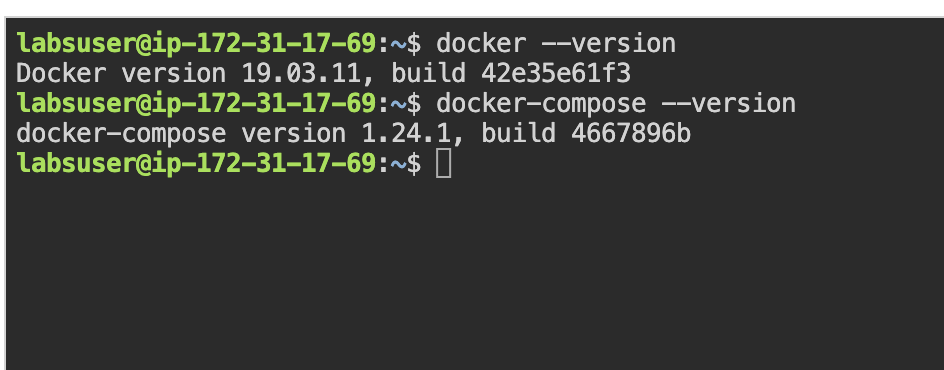
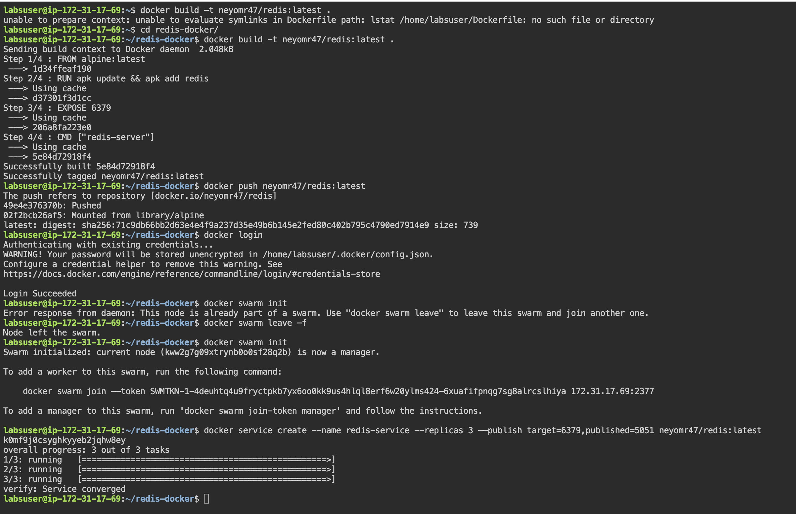
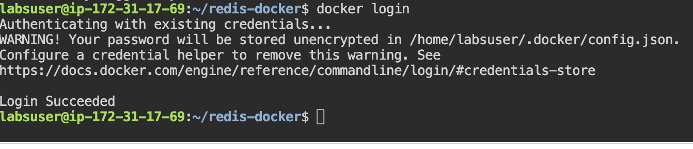
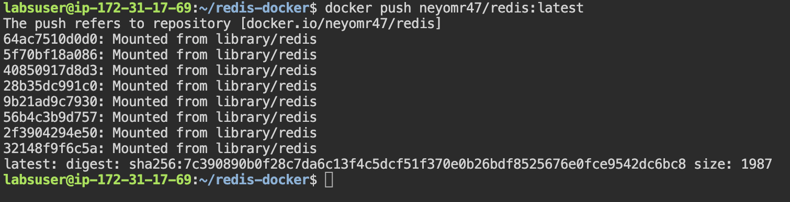
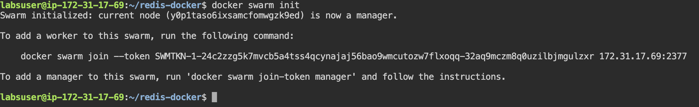
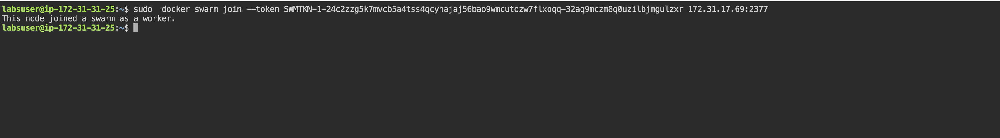
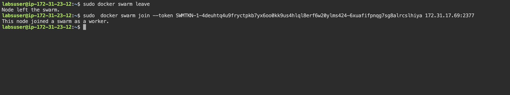
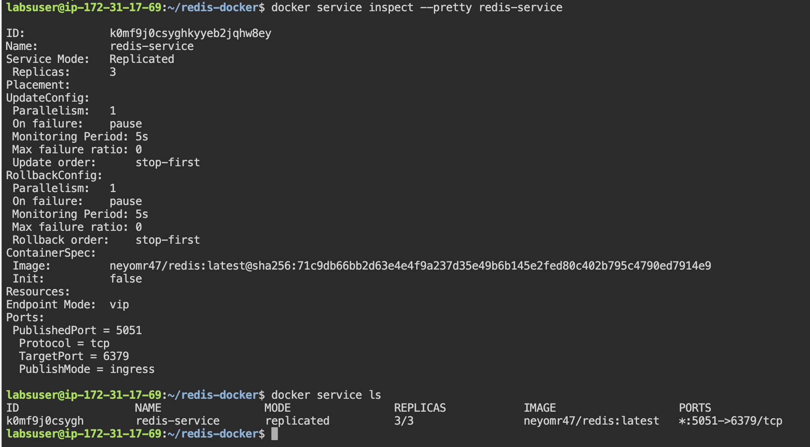

#  Deploying Redis-Based Docker Image on a Swarm Cluster for Scalable Data Storage and Caching

## Step 1: Set Up Docker

``` sudo apt-get update 
sudo apt-get install \
apt-transport-https \
ca-certificates \
curl \
gnupg \
lsb-release ```

```
curl -fsSL https://download.docker.com/linux/ubuntu/gpg | sudo gpg --dearmor -o /usr/share/keyrings/docker-archive-keyring.gpg```


```
echo \
"deb [arch=amd64 signed-by=/usr/share/keyrings/docker-archive-keyring.gpg] https://download.docker.com/linux/ubuntu \
$(lsb_release -cs) stable" | sudo tee /etc/apt/sources.list.d/docker.list > /dev/null
```



`sudo apt update`

`sudo apt-get install docker-ce`

`docker  --version`

`sudo usermod -a -G docker $USER`

`sudo su - $USER`

- Docker compose installation


``` sudo curl -L https://github.com/docker/compose/releases/download/1.24.1/docker-compose-`uname -s`-`uname -m` -o /usr/local/bin/docker-compose ```

`sudo chmod +x /usr/local/bin/docker-compose`

`docker-compose --version`

##  Step 2: Create a Redis-based Docker Image

`mkdir redis-docker`

`cd redis-docker`
`sudo nano Dockerfile`

``` Use the official Alpine image from Docker Hub
FROM alpine:latest

# Install Redis
RUN apk update && apk add redis

# Expose the Redis port
EXPOSE 6379

# Start Redis server and provide an easy way to run redis-cli
CMD ["redis-server"]
```

`docker build -t neyomr47/redis:latest .`



##  Step 3: Publish the Image to Docker Hub

`docker login`

`docker push neyomr47/redis:latest`






# Step 4: Deploy the Image on a Docker Swarm Cluster

`docker swarm init`

`docker service create --name redis-service --replicas 3--publish target=6379,published=5051 neyomr47/redis:latest`










